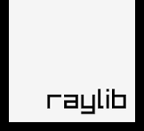

# Omar

**Indie developer. I make games and apps from scratch**

- 🌍 Based somewhere with good Wi-Fi and bad sleep schedules
- 🎮 Currently building games with **C++ & Raylib** and **Godot & GDScript**
- 📱 I also like build cross-platform apps with **Dart & Flutter**
- 🔨 First you have to understand *why* things work over just making them work
- ⚡ Fun fact: I think GDScript is underrated and C++ is timeless

---

## 🎮 Games

> Check out my games on itch.io 👇

---

## 🛠️ Skills

### Languages

)

### Game Dev

### App Dev

### Tools & Environment

---

## 📊 GitHub Stats

---

*"C and C++ are the Latin of programming languages, learn them and everything else makes sense."*
